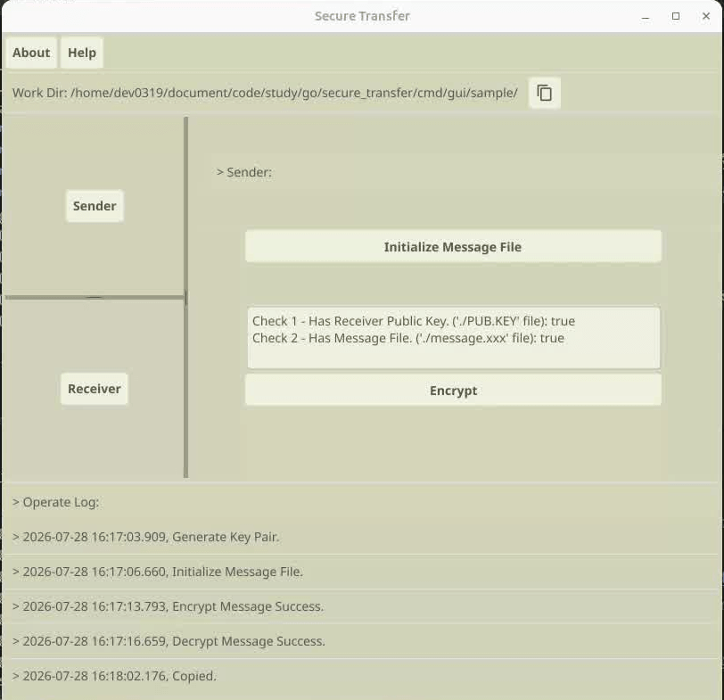

# 安全的信息传输工具 Secure Message Transfer Tool

本工具可以让两个人在不安全的通信信道上，以文件为载体，安全的传递信息

## 使用

> 以命令行程序使用，参考：`/cmd/cli/script/manual.md`
> 以图形化界面程序使用，参考：`/cmd/gui/components/utils.go helpText`
>
> 我们会提供一些平台的可执行程序，但我们建议你阅读源代码后自行编译。

编译：以命令行形式使用无需外部依赖 (go install)，以GUI形式使用需要安装依赖

- 我们提供的cli编译脚本写的不好、需要安装gui相关依赖，仅供参考
- fyne存在交叉编译问题：仅根据文档中要求下载的内容，无法在linux上编译windows可执行文件

[下载go、C编译器和系统显卡驱动程序](https://docs.fyne.io/started/quick/)

```cmd
go get fyne.io/fyne/v2@latest
go install fyne.io/tools/cmd/fyne@latest
```

### GUI

因为fyne依赖cgo，如果编译环境和你的系统的glibc版本不兼容，则可执行程序无法使用，
因此放弃提供gui的二进制文件，仅在本小节附使用截图



## 实现

方案：使用椭圆曲线协商算法得到共享密钥，共享密钥派生得到最终加密密钥，使用对称加密算法加密

- 曲线与密钥协商算法：Curve25519 X25519
- 最终加密密钥派生算法：sha256
- 对称加密算法：aes-gcm

过程：

1. 甲生成一个临时密钥对，使用临时私钥和乙的公钥一起协商出共享密钥，共享密钥派生得到最终加密密钥
2. 甲使用最终加密密钥加密想要发送的消息，将临时公钥、nonce、密文拼在一起，发送给乙
3. 乙使用自己的私钥和临时公钥一起协商出共享密钥，派生得到最终加密密钥，结合nonce，解密密文

加密文件编码规则：`pubk length + pubk + nonce + ciphertext`

- pubk length: 1 Byte，本工具中固定为32
- pubk：32 Bytes，公钥
- nonce：12 Bytes
- ciphertext：明文长度 + 16 Bytes（这个16 Bytes应该是加密算法的原因）

所以密文的大小会比明文多61 Bytes (?)

## 技术准备

### 椭圆曲线密码学

Elliptic Curve Cryptography 椭圆曲线密码学 (ECC)
Elliptic Curve Digital Signature Algorithm 椭圆曲线数字签名算法 (ECDSA)

背景知识：（以ethereum为例，大写表示可以公开）

- 椭圆曲线上的一个点，我们为其定义了加法和乘法运算
- 假设公钥为K、私钥为k、曲线基点为G，有K=kG
- 私钥：256 bits随机数；公钥：512 bits；地址：160 bits
- 私钥 - (椭圆曲线乘法)-> 公钥 - (Keccak-256 hash & 取后20字节)-> 地址

不同平台之间各有不同，但总体上多是：根据私钥计算公钥、根据公钥计算地址

#### 加、解密

使用随机数r将明文消息M生成密文C，该密文是一个点对： C = {rG, M+rK}

解密则是使用C、k还原M的过程： M = M + rkG - rkG = (M + rK) - k (rG)
即用C的第二个点减去k乘以第一个点，得到的结果就是明文M

- 前文提到：公钥K=私钥k*基点G

#### 签名验签 (?)

签名：

- 对明文做hash，得到H（256 bits）
- K=k*G，取r=K.x
- s = k⁻¹ * (H + r * k) mod n
    - k⁻¹ 是 k 在模 n 下的模逆元
    - n 是曲线的阶
- v: 标识K.y是奇数还是偶数
- 签名结果： (r, s, v)

验签：可以拿到消息hash H和签名结果 (r, s, v)

- 根据H和签名可以恢复出公钥，根据公钥计算出地址A，即可以确认这个签名是A签的

### DH交换算法 (Diffie-Hellman)

DH算法是一种在不安全的通信信道上安全地交换密钥的协议。算法只协商密钥，不负责加密

原理是在数学问题中，正着计算过去相对容易，而反着推则非常困难。

过程：（大写字母表示可以公开）

- 甲和乙约定两个数P和G
- 甲使用随机数a计算 A = G^a (mod P)
- 乙使用随机数b计算 B = G^b (mod P)
- 甲、乙交换A、B
- 甲计算 S = B^a (mod P)
- 乙计算 S = A^b (mod P)
- 在数学上，两人计算出的S相同

ECDH算法则是结合了椭圆曲线的密钥协商算法，X25519是比较常用的一种

### 密钥派生函数 KDF Key Derive Function

绝大多数现代协议都不会直接使用原始密钥，而是先经过 KDF。

为什么需要KDF：

- 协商出的密钥可能并不均匀
- 一个共享密钥可能需要派生出多个密钥
- 密钥隔离
- 绑定更多上下文

### 混合加密

非对称加密的数学算法在实际应用中有着诸多限制：

- 对原文长度有要求，加密的数据量不能超过密钥阶数，即一个2048位的密钥单次只能加密256字节的数据
- 速度慢，考虑到cpu的针对性指令集，对称加密比非对称加密快100～1000倍

所以在实际应用中，即使宣称使用非对称加密技术，其底层实际用于加密的算法，大多也是对称加密，例如以太坊go sdk (ecies)

## 问题

- 编写技术验证demo遇到问题：最新版本的go（1.25）和ethereum（1.16）无法匹配。  
  因为我们没有使用以太坊的曲线 (secp256k1)。放弃go-ethereum，自行编写相关过程（密钥协商、派生和加/解密）
